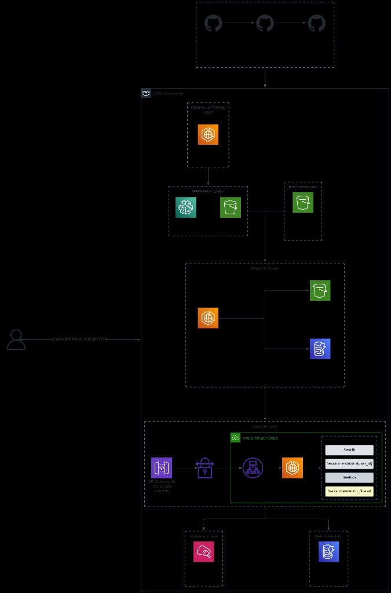

# SOLUTION — Personalization Service

Documento de entrega do case técnico. Descreve o que foi construído, como executar, decisões tomadas e limitações conhecidas.

---

## Visão geral

A solução separa **treino**, **predição em batch** e **serving HTTP** em três aplicações Python, todas containerizadas e deployadas na AWS via Terraform:

| Aplicação | Papel |
|-----------|--------|
| `model_train` | Treina o classificador sklearn, publica artefato no S3 e registra versão no SageMaker Model Registry |
| `model_predict` | Gera scores para todos os pares usuário×produto, grava snapshot no S3 e substitui a tabela DynamoDB |
| `recommendations_api` | API REST síncrona que lê predições pré-computadas e responde em tempo de requisição |

**Por que batch + API leve?** O modelo scoreia ~30k pares (500 usuários × 60 produtos) por execução. Rodar feature engineering + inferência a cada `GET` aumentaria latência (centenas de ms a segundos) e custo. A API consulta DynamoDB (single-digit ms na leitura) e mantém o contrato síncrono exigido pelo case.

### Arquitetura na AWS

<p align="center">
  
</p>

O fluxo completo, da esteira de CI/CD até a resposta síncrona ao usuário:

| Camada | Componentes | Responsabilidade |
|--------|-------------|------------------|
| **Continuous Training** | GitHub Actions → ECS `model_train` | Dispara o pipeline de treino a cada deploy; treina sklearn, sobe artefato para S3 e registra versão no SageMaker Model Registry |
| **Model Versioning** | SageMaker Model Registry + S3 (`models/`) | Versiona e aprova model packages; `model_predict` consome a versão aprovada |
| **Data Process** | S3 (`training-data/`) | Armazena `events.csv` e `products.csv` — fonte única para feature engineering |
| **Prediction** | ECS `model_predict` → S3 + DynamoDB | Job batch: calcula scores, grava CSV versionado no S3 e substitui snapshot na tabela `personalization-predictions` |
| **Endpoint (serving)** | API Gateway → NLB → ECS `recommendations_api` | Resposta **síncrona**: lê DynamoDB, aplica cold start/filtros e retorna JSON |
| **Monitoring** | CloudWatch Logs | Logs JSON estruturados de treino, batch e API |
| **Metrics Register** | DynamoDB (`personalization-api-metrics`) | Persiste contadores e latências consumidas pelo `/metrics` (Prometheus) |

Rotas expostas via API Gateway (autenticação por `x-api-key`, exceto `/health`):

- `GET /health`
- `GET /recommendation/{user_id}` e `GET /recommendations/{user_id}`
- `POST /recommendation_filtered` e `POST /recommendations_filtered`
- `GET /metrics`

Pipeline de deploy (GitHub → AWS):

```
push → CI (pylint + unit tests)
     → terraform apply
     → integration tests (AWS real)
     → push imagens ECR (somente se testes passarem)
     → rollback Terraform (se integração falhar)
```

---

## Como rodar o projeto

### Pré-requisitos

- Python **≥ 3.12**
- Docker (opcional, recomendado para paridade com produção)
- AWS CLI + credenciais (apenas para deploy e testes de integração)
- Terraform **≥ 1.9** (deploy de infra)

### Instalação local

```bash
git clone <repo>
cd personalization_case
python -m venv .venv && source .venv/bin/activate
pip install -r requirements-dev.txt
```

### Testes unitários (padrão, sem AWS)

```bash
pytest                    # 107 testes, ~1s
pylint src                # lint do código de produção
```

Testes de integração são **excluídos** do `pytest` padrão (`-m "not integration"`).

### Testes de integração (AWS real)

Requer infra aplicada e credenciais configuradas:

```bash
cd terraform
terraform init
terraform apply -var="image_tag=UAT" -var="aws_region=us-east-1"

cd ..
pytest tests/integration -m integration -s
```

Ordem enforced: `model_train` → `model_predict` → `recommendations_api`.  
O teste da API exige predições no DynamoDB (geradas pelo `model_predict`).

> **Nota:** `model_predict` substitui ~30k linhas no DynamoDB e pode levar **vários minutos**.

### API local (sem ECS)

Com variáveis apontando para recursos AWS já existentes:

```bash
export AWS_REGION=us-east-1
export DATA_BUCKET=<terraform output data_bucket_name>
export PREDICTIONS_DYNAMODB_TABLE=<terraform output predictions_dynamodb_table_name>
export METRICS_DYNAMODB_TABLE=<terraform output api_metrics_dynamodb_table_name>

PYTHONPATH=src uvicorn recommendations_api.main:app --host 0.0.0.0 --port 8080
```

Endpoints locais:

| Método | Rota | Descrição |
|--------|------|-----------|
| `GET` | `/health` | Liveness |
| `GET` | `/metrics` | Métricas Prometheus 0.0.4 |
| `GET` | `/recommendations/{user_id}` | Top-N recomendações (N=10) |
| `POST` | `/recommendations_filtered` | Recomendações com filtros |

### Pipelines batch locais

```bash
# Treino (grava model.pkl no S3 + SageMaker Registry)
export DATA_BUCKET=... MODEL_BUCKET=... MODEL_PACKAGE_GROUP_NAME=...
export INFERENCE_IMAGE_URI=... IMAGE_TAG=local-dev
PYTHONPATH=src python -m model_train.main

# Predição (lê CSVs do S3, escreve DynamoDB)
export PREDICTIONS_DYNAMODB_TABLE=...
PYTHONPATH=src python -m model_predict.main
```

### Docker

```bash
docker build -f docker/recommendations_api/Dockerfile -t recommendations-api .
docker build -f docker/model_predict/Dockerfile -t model-predict .
docker build -f docker/model_train/Dockerfile -t model-train .
```

### Deploy na AWS (produção)

O pipeline GitHub Actions (`workflow.yaml`) executa:

1. **CI** — pylint + pytest unitário (PR e push)
2. **CD** (somente push, não PR):
   - `terraform apply`
   - **testes de integração AWS**
   - push das 3 imagens para ECR (somente se testes passarem)
   - rollback automático do Terraform se integração falhar

Secrets necessários no repositório: `AWS_ACCESS_KEY_ID`, `AWS_SECRET_ACCESS_KEY`, `AWS_REGION`.

Endpoint público (após deploy):

```bash
terraform output -raw recommendations_api_gateway_endpoint   # ex: .../v1
terraform output -raw recommendations_api_key                # header x-api-key
```

Exemplo:

```bash
curl -H "x-api-key: $API_KEY" "$ENDPOINT/recommendations/u_0231"
curl -H "x-api-key: $API_KEY" "$ENDPOINT/metrics"
```

---

## Endpoints e contratos

### `GET /recommendations/{user_id}`

Retorna até **10 produtos** ranqueados por `recommendation_score` (probabilidade de compra do modelo).

```json
{
  "user_id": "u_0231",
  "count": 10,
  "cold_start_flag": false,
  "recommendations": [
    {"product_id": "p_0042", "score": 0.67, "rank": 1}
  ]
}
```

### `POST /recommendations_filtered`

Body JSON com filtros opcionais: `limit`, `exclude_product_ids`, `categories`, `exclude_categories`, `min_price`, `max_price`, `min_avg_rating`, `min_popularity_score`, `min_recommendation_score`, `only_affinity_match`, `exclude_cold_start`, `context`.

Resposta inclui metadados enriquecidos (`category`, `price`, etc.) além do score.

### Autenticação

Na AWS, API Gateway exige header `x-api-key` em todas as rotas exceto `/health`.

---

## Preparação de features e `user_affinity_match`

Implementação em `model_predict/domain/usecases/featureengineer.py` (espelhada no treino em `model_train`):

1. **Pares usuário×produto:** produto cartesiano de usuários distintos em `events.csv` × catálogo em `products.csv`.
2. **`interactions`:** contagem de eventos por `(user_id, product_id)`; `0` se ausente.
3. **`price`, `avg_rating`, `popularity_score`:** join com `products.csv`.
4. **`user_affinity_match`:**
   - Join de eventos do usuário com categorias dos produtos.
   - Contagem de interações por `(user_id, category)`.
   - Categoria com **maior contagem** vira `top_affinity_category`.
   - **Desempate:** ordem alfabética de `category` (critério determinístico, documentado).
   - `user_affinity_match = 1` se `product.category == top_affinity_category`, senão `0`.

Features são validadas via entidades (`Costumer` / `Customer`) antes de escalar e inferir. O scaler e o modelo consomem matrizes **numpy** (sem nomes de colunas) para compatibilidade com o artefato original (`scikit-learn>=1.8.0,<1.9.0`).

---

## Cold start

**Cenário:** `user_id` sem linhas na tabela de predições (usuário ausente de `events.csv` ou ainda não scoreado).

**Estratégia:** fallback por **popularidade global**.

1. API consulta DynamoDB por `user_id`.
2. Se vazio → carrega `products.csv` do S3 (cache in-process com `@lru_cache`).
3. Retorna top-N produtos ordenados por `popularity_score`.
4. `recommendation_score` = `popularity_score`; `cold_start_flag: true` na resposta.
5. Logs registram `cold_start_fallback_selected`.

**Trade-off:** simples, determinístico e explicável; não personaliza nada além da popularidade. Alternativas futuras: trending por categoria, embeddings, ou bandit exploration.

---

## Decisões de arquitetura e trade-offs

### 1. Batch predict + DynamoDB em vez de inferência online

| Prós | Contras |
|------|---------|
| Latência baixa e previsível na API | Predições ficam stale até próximo batch |
| Custo de inferência concentrado em job agendado | Novos usuários/produtos só aparecem após re-run |
| Escala horizontal da API sem carregar sklearn | Tabela grande (~30k+ itens) no replace completo |

### 2. Replace completo da tabela DynamoDB

Cada `model_predict` faz scan → delete → put de todo o snapshot. Garante consistência (“tabela = última execução”), mas é **lento** (~minutos) e caro em escala. Alternativa: particionar por versão ou usar TTL + writes incrementais.

### 3. Três apps separadas

Isola responsabilidades e permite escalar/versionar treino, batch e API independentemente. Custo: mais imagens Docker, mais Terraform e mais superfície operacional.

### 4. Clean Architecture leve

Cada app segue `domain/entities`, `domain/usecases`, `domain/gateways`, `main.py`. Facilita testes unitários com mocks nos gateways e testes de integração sem mock nas bordas AWS.

### 5. SageMaker Model Registry

`model_train` registra pacotes aprovados; `model_predict` consome **versão fixa** (`HARDCODED_MODEL_PACKAGE_VERSION = 1`) para reprodutibilidade. Versões novas exigem bump explícito — seguro, porém manual.

### 6. Métricas persistentes no DynamoDB

Contadores e latências sobrevivem restart do container e alimentam `/metrics` via `prometheus_client`. Trade-off: write amplificado por request vs. solução in-memory.

### 7. CI/CD com gate de integração

Testes AWS rodam **após** `terraform apply` e **antes** do push de imagens. Falha → rollback do state Terraform. Protege infra quebrada, mas aumenta tempo de pipeline e exige conta AWS dedicada ao CI.

---

## Testes

### Unitários (`tests/`, espelha `src/`)

- **107 testes** cobrindo feature engineering, handlers, filtros, cold start, métricas, gateways (com mocks boto3/sklearn).
- Execução rápida (~1s), roda em todo PR.

### Integração (`tests/integration/`)

Três testes **sem mocks**, contra AWS real:

| Ordem | Teste | Valida |
|-------|-------|--------|
| 1 | `model_train` | Pipeline de treino → S3 + SageMaker Registry |
| 2 | `model_predict` | Pipeline completo → S3 + DynamoDB |
| 3 | `recommendations_api` | `TestClient` + conectores reais (DynamoDB, S3, métricas) |

O teste da API exercita HTTP de ponta a ponta (`TestClient` → FastAPI → handler → AWS), sem mockar camadas internas — atende ao requisito do README de integração com fluxo real.

---

## Observabilidade

### Logs (JSON estruturado)

Componentes emitem logs via `ApiLogger` / `ModelRunnerLogger` / `ModelTrainerLogger`:

```json
{
  "timestamp": "2026-07-29T22:22:32Z",
  "level": "INFO",
  "component": "main",
  "event": "recommendation_request_completed",
  "user_id": "u_0231",
  "latency_ms": 14.2,
  "cold_start_flag": false,
  "count": 10
}
```

Campos principais por request: `user_id`, `latency_ms`, `cold_start_flag`, `count`, `source`. Em ECS, logs vão para CloudWatch (`watchtower` quando disponível).

### Métricas (`GET /metrics`, Prometheus 0.0.4)

| Métrica | Tipo | Descrição |
|---------|------|-----------|
| `recommendations_api_requests_total` | Counter | Total de requests |
| `recommendations_api_errors_total` | Counter | Erros 4xx/5xx |
| `recommendations_api_cold_start_total` | Counter | Fallbacks cold start |
| `recommendations_api_latency_ms` | Summary | p50/p95 + sum/count |
| `recommendations_api_latency_avg_ms` | Gauge | Média |

Persistência em DynamoDB (`personalization-api-metrics`) via `DynamoDBMetricsStore`; fallback in-memory quando `METRICS_DYNAMODB_TABLE` não está definido (dev local).

---

## O que faria diferente com mais tempo

1. **Inferência incremental** — scorear só pares novos/alterados em vez de cartesiano completo; ou cache Redis por `(user_id, product_id)`.
2. **Agendamento gerenciado** — EventBridge + ECS RunTask para `model_predict` diário, com alarmes se falhar.
3. **Blue/green no deploy da API** — CodeDeploy ou second ECS service antes de trocar tráfego.
4. **Versionamento de predições** — chave composta `(user_id, product_id, model_version)` no DynamoDB para rollback de modelo sem downtime.
5. **Endpoint de recomendação real-time opcional** — para usuários VIP ou A/B, com timeout e circuit breaker.
6. **Otimizar writes DynamoDB** — `batch_writer` com backoff, paralelismo e delete por GSI em vez de scan full table.
7. **Retreino automatizado** — pipeline que promove nova versão no Registry após métricas offline passarem.
8. **Documentação OpenAPI enriquecida** — exemplos de cold start, filtros e códigos de erro no Swagger.

---

## Observabilidade futura

| Hoje | Com mais tempo |
|------|----------------|
| Logs JSON em CloudWatch | Correlação com `trace_id` / OpenTelemetry |
| Métricas Prometheus + DynamoDB | Remote write → AMP/Grafana + dashboards |
| Latência p50/p95 no Summary | SLOs + alertas PagerDuty (p95 > X ms, error rate > Y%) |
| Contador de cold start | Dashboard de % cold start por cohort |
| — | Tracing distribuído (API → DynamoDB → S3) |
| — | Audit log de filtros aplicados (compliance) |
| — | Métricas de negócio: CTR estimado, diversidade de categorias |

---

## Estrutura do repositório

```
src/
├── model_train/           # treino + registro SageMaker
├── model_predict/         # batch scoring → S3 + DynamoDB
└── recommendations_api/ # FastAPI serving
docs/
└── architecture.jpeg      # diagrama de arquitetura AWS
tests/                     # unitários (espelham src/)
tests/integration/         # AWS real (3 testes)
terraform/                 # ECS, S3, DynamoDB, API Gateway, IAM, ECR
docker/                    # Dockerfiles das 3 apps
.github/workflows/         # CI (unit) + CD (terraform → integração → push)
data/                      # CSVs de referência local
model/                     # model.pkl + model_card.json originais do case
```

---

## Variáveis de ambiente principais

| Variável | App | Descrição |
|----------|-----|-----------|
| `DATA_BUCKET` | todos | Bucket S3 com `events.csv` / `products.csv` |
| `PREDICTIONS_DYNAMODB_TABLE` | predict, API | Tabela de predições |
| `METRICS_DYNAMODB_TABLE` | API | Tabela de métricas |
| `MODEL_PACKAGE_GROUP_NAME` | train, predict | SageMaker Model Registry group |
| `INFERENCE_IMAGE_URI` | train | URI ECR registrada no model package |
| `AWS_REGION` | todos | Região AWS (default `us-east-1`) |

Lista completa nos `load_config()` de cada `main.py` e nos outputs do Terraform (`terraform output`).

---

## Limitações conhecidas

- Predições desatualizadas entre execuções de `model_predict`.
- Replace DynamoDB O(n) — lento para catálogos grandes.
- Model package version hardcoded em `model_predict` (v1).
- Rollback do CI reverte **infra Terraform**, não dados escritos nos testes de integração.
- `scikit-learn` pinado em 1.8.x para compatibilidade com artefato existente no S3.

---

## Referências rápidas

- Model card: `model/model_card.json`
- Notebook de testes de endpoint: `notebooks/testing_endpoint.ipynb`
- Exemplo tfvars: `terraform/terraform.tfvars.example`
